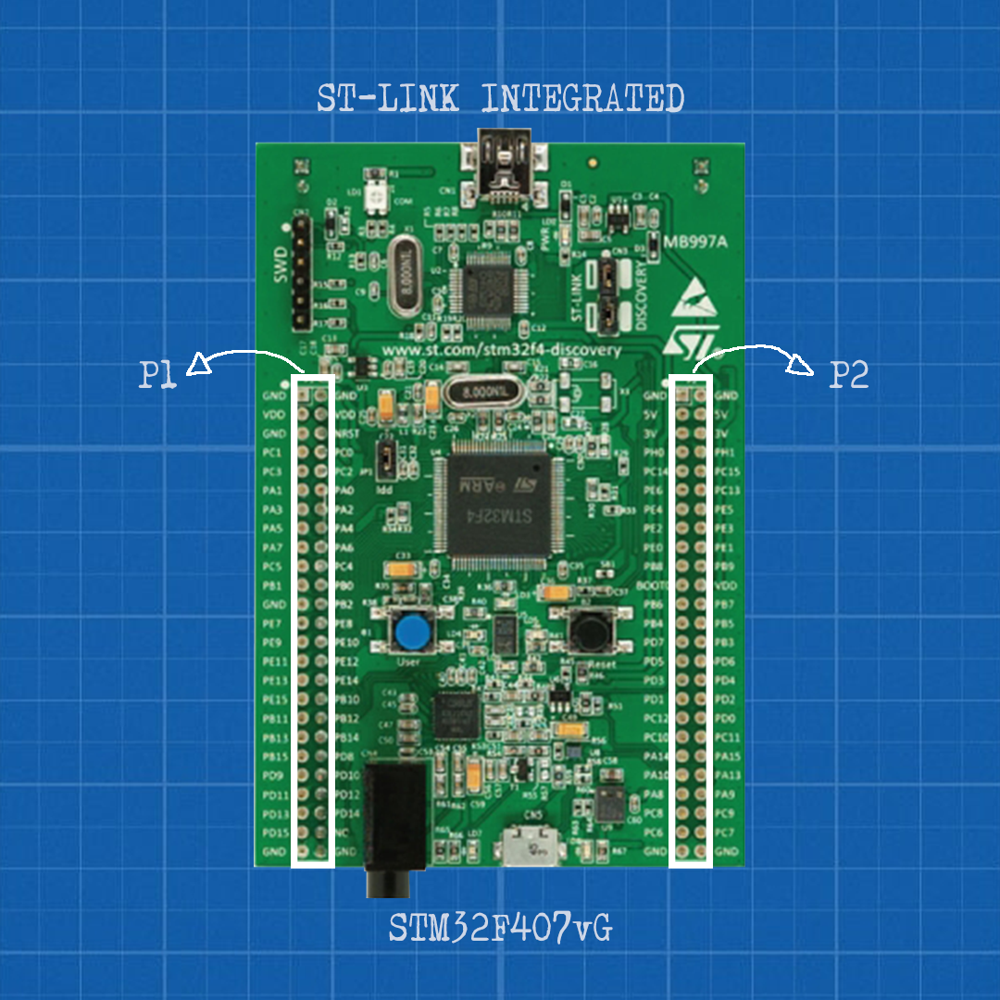
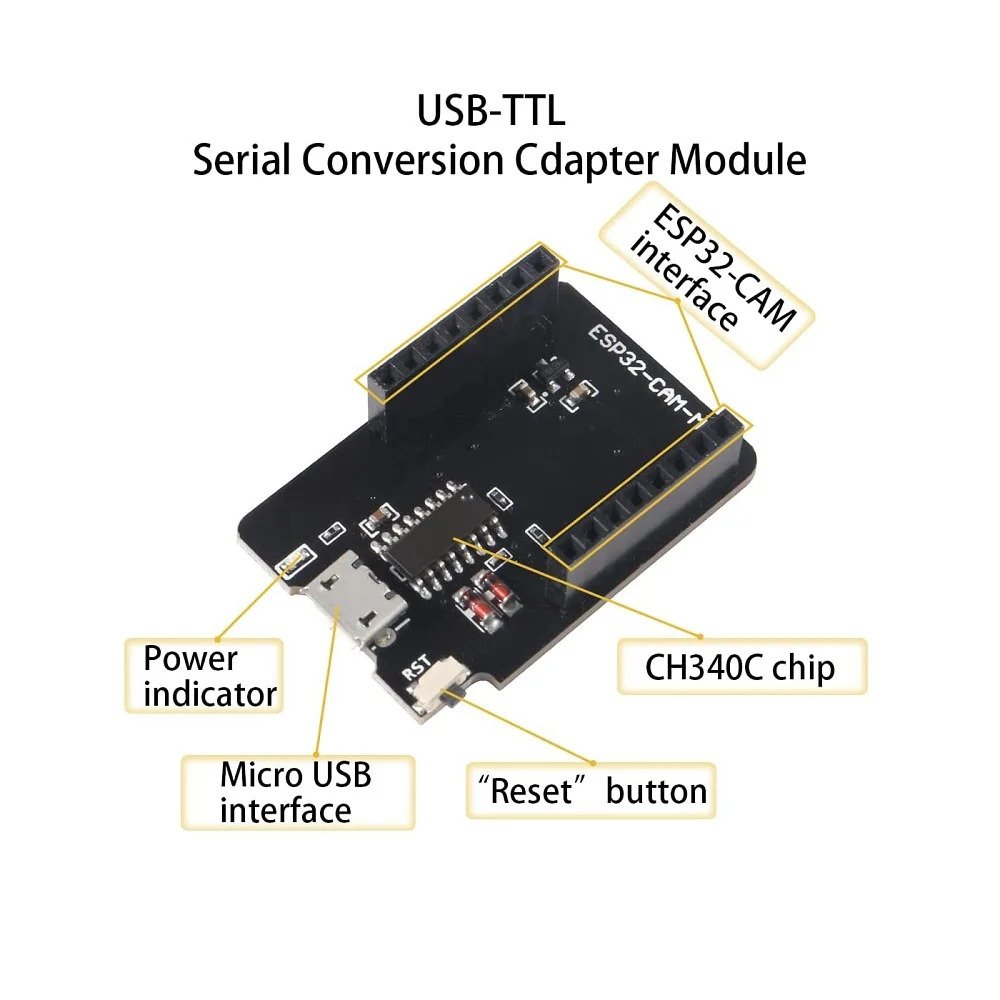
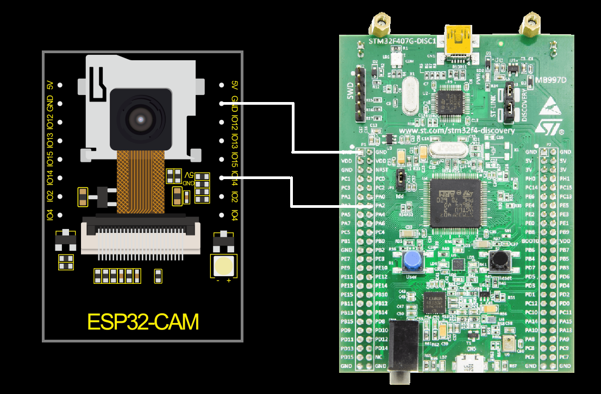

## STM32duino-Serial-Communication

How to Serial communication between STM32 board and Arduino or ESP32 Board.

by using [Arduino IDE](https://docs.arduino.cc/software/ide-v1/tutorials/Windows) application (Software).

## Introduction

The serial communication makes sure every byte of the data is transferred to the another device
RX receives serial data and TX sends the serial data to other board or device

In this write-up, serial communication in Arduino is explained in detail with the help of a simple example.
I have a project with stm32 but I'm lack of familiarity about Cube IDE, I'm looking for a way to program stm32 with Arduino IDE. 

## Acknowledgements
- [STM32 Flasher](https://www.st.com/en/development-tools/flasher-stm32.html)
- [STM32 as Arduino](https://create.arduino.cc/projecthub/akarsh98/using-a-stm32-like-an-arduino-tutorial-stm32f103c8-1073cb)


## Background

In STM32, There are some pins that can be used as Serial Communication; you can get information about pin on [datasheet](https://www.st.com/resource/en/datasheet/dm00037051.pdf)
for example in Arduino pin 0 and pin 1 are assigned for the serial communication known as 
[UART](https://www.techopedia.com/definition/3669/universal-asynchronous-receivertransmitter-uart) (Universal Asynchronous Receiver Transmitter) and 
[USART](https://www.techopedia.com/definition/9850/universal-synchronousasynchronous-receivertransmitter-usart) (Universal Synchronous Asynchronous Receiver Transmitter) 
and they are also known as Tx/Rx pins
Or in STM32 you can use PA2 Pinout as USART_TX; and PA3 Pinout as USART_RX

## Getting started

These steps are discussed in details below

 - Hardware: make sure you have two microcontroller and wire them together
 - Software: make sure you have the [Arduino IDE](https://www.arduino.cc/en/software) and install this library 
   https://raw.githubusercontent.com/stm32duino/BoardManagerFiles/master/STM32/package_stm_index.json
 - Example: open, compile, flash and run one of the library examples
 - Download and install the Flasher tool by using which Device Type 

- I Used STM32 and connected with ESP32-CAM
Before Used Read about [STM32](https://www.stm32duino.com/viewtopic.php?t=1512)
- STM32 Library that I Used [STM32f407](https://www.renesas.com/us/en/document/dst/ra4m3-group-datasheet?r=1400806) ; I recommend to always read the datasheet.

### Hardware
The hardware 

 - You need an STM32, e.g. an [STM32f407](https://www.st.com/en/microcontrollers-microprocessors/stm32f407-417.html#overview).
 - You can use any [Arduino family](https://www.arduino.cc/en/hardware) or [ESP32](https://cdn.sparkfun.com/assets/7/8/e/4/f/esp32-s2_datasheet.pdf)
 in this project I Used ESP32CAM, e.g. an [ESP32-CAM](https://makeradvisor.com/esp32-camera-cam-boards-review-comparison/).
 - Than Connect the ESP32-CAM board to your computer using an FTDI programmer. Follow the next schematic diagram: 
 
 
   Or You can buy a Dev Board module for ESP32-CAM [Dev Board](https://www.lazada.co.id/products/esp32-cam-dev-board-usb-to-ttl-ch340-camera-ov2640-esp-32-esp-32-i5080040515.html). which are sold separately!.


### Software
The software that used
 - It is assumed that you have the Arduino IDE installed. If not, refer to "Install the Arduino Desktop IDE" 
   on the [Arduino site](https://www.arduino.cc/en/Guide/HomePage). If you follow the default install, 
 - It is assumed that you have to install the JSON library on the top
 - Stm32 need flasher to programed, so make sure that [STM32 Flasher](https://www.st.com/en/development-tools/flasher-stm32.html) installed


## Run the program

- First, you have to add this code in void setup(); to Activate Serial Communication on STM32Board  

```
void setup(){
  Serial.begin(9600);
  HardwareSerial Serial1(PA2,PA3);
  }
```
- Notes On the Code: I Used PA2 Pinout as TX; and PA3 Pinout as RX; just connected them to another RX/TX after you uploaded the code.
- You can also Used another Pinout which is available 
- in the ESP32-CAM I Used GPIO 3 as RX; GPIO 1 as TX;

Now Lets try!
This is code for sender STM32, you can use 9600 baud
```
void setup() {
  //Serial Begin at 9600 Baud
  Serial.begin(9600);
  HardwareSerial Serial1(PA2,PA3);
}

void loop() {
  //Write '123' to Serial
  Serial.write(123);
  delay(1000);
}
```
And this is code for Receiver ESP32; First declared a variable to store received data. In Setup, Serial Begin at 9600 Baud. In the loop, read the serial data and store it in a variable.

```
int data; //Initialized variable to store recieved data

void setup() {
  //Serial Begin at 9600 Baud 
  Serial.begin(9600);
}

void loop() {
  data = Serial.read(); //Read the serial data and store it
  delay(1000);
}
```

### Upload the Code
Upload the code to STM32 and Arduino Board. 
Before uploading, make sure your RX/TX not connected to each other;
After uploading code. Connect TX STM32 TO RX ESP32 if its success,in serial monitor esp32 ‘123’ will be transmitted from Sender STM32 to Receiver ESP32. 



!Important: GND(Ground) should be connect each other

### Support
see the [Forum](https://forum.arduino.cc/c/software/arduino-ide-2-0/93) arduino for more issue 
### Another project 
Lets see another project such as How to [Connecting ESP32CAM to Smartphone](https://github.com/electricianinsomniac/ESP32CAM-to-Smartphone) by using WIFI connection 
